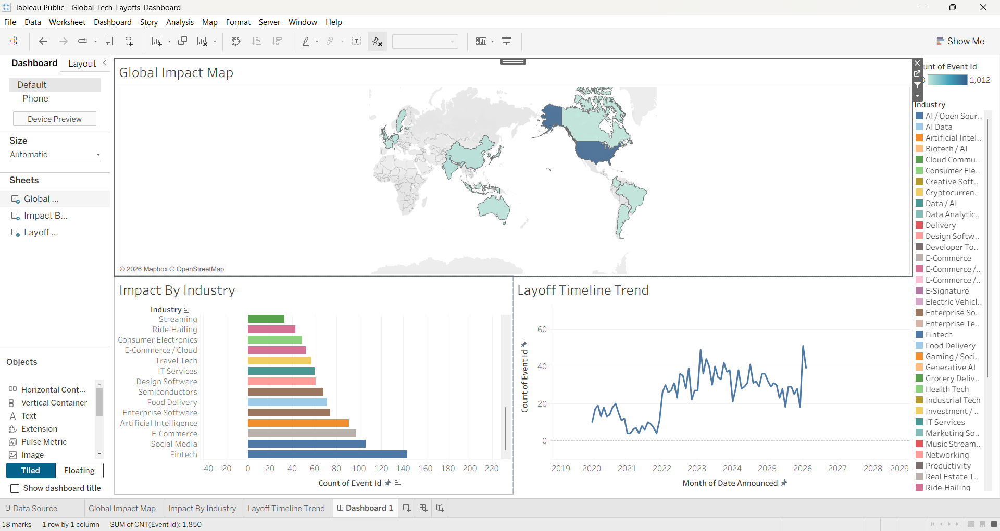

# Global Tech Layoffs & Market Trends Analysis

An interactive enterprise-grade Tableau data analytics platform engineered to isolate, track, and visualize macroeconomic restructuring indicators across global technology ecosystems from 2020 to 2026.

## 📊 Live Interactive Dashboard
👉 **[Click Here to View the Live Interactive Dashboard](https://public.tableau.com/app/profile/shabbir.rajgarh/viz/Global_Tech_Layoffs_Dashboard/Dashboard1?publish=yes)**

---

## 🖥️ Dashboard Architecture

---

## 🚀 Key Analytical Insights
* **Macro Temporal Trends:** Tracks the cyclical wave of workforce restructuring across the global tech sector, highlighting pivotal spikes and normalization phases over a multi-year timeline.
* **Sector-Specific Vulnerability:** Pinpoints which business models (e.g., Fintech, Social Media, E-commerce) faced the highest frequency of organizational restructuring.
* **Geographical Distribution:** A complete spatial heatmap mapping the density of restructuring actions across international tech hubs, enabling rapid regional impact assessment.

---

## 🛠️ Technical Workflow & Tooling
* **Data Layer:** Processed a structured dataset of 1,850+ individual corporate restructuring event records via CSV.
* **Aggregation Metrics:** Engineered optimized calculated counts (`CNT(Event Id)`) to extract clean frequency volumes without dimension cluttering.
* **UI/UX & Interactivity:** Developed bidirectional Dashboard Actions ("Use as Filter"), enabling end-users to click any country or tech sector to dynamically filter the entire workspace globally in real time.
* **Deployment:** Packaged and published via Tableau Public (`.twbx`) for cross-platform compliance and executive review.
